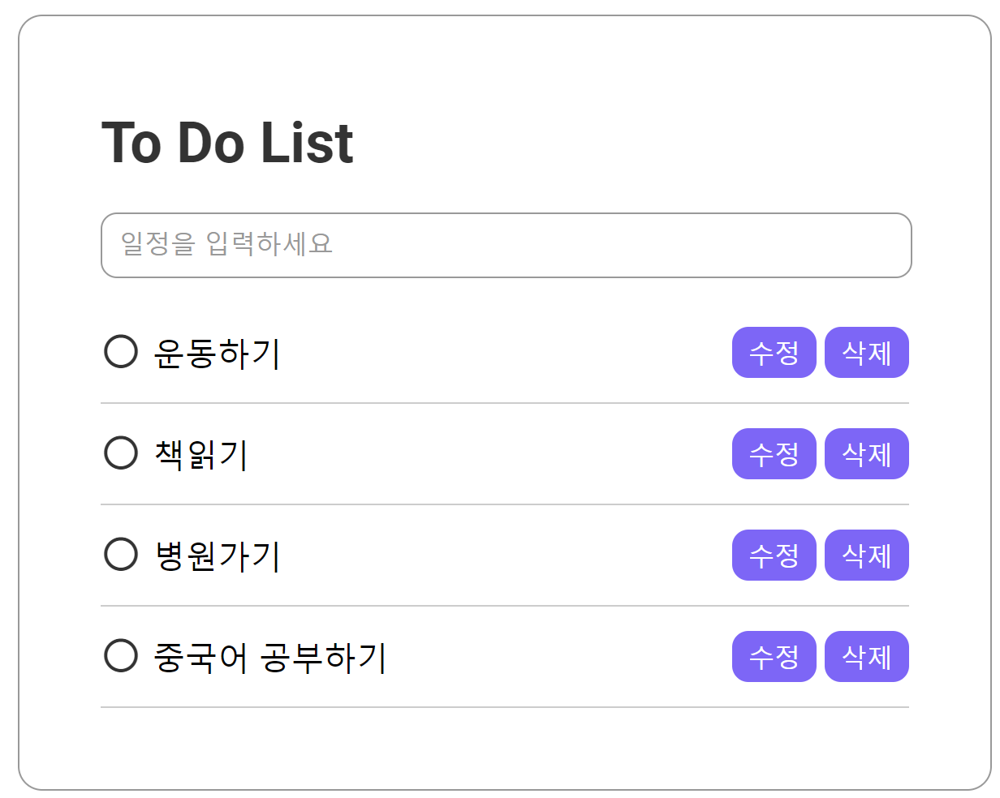
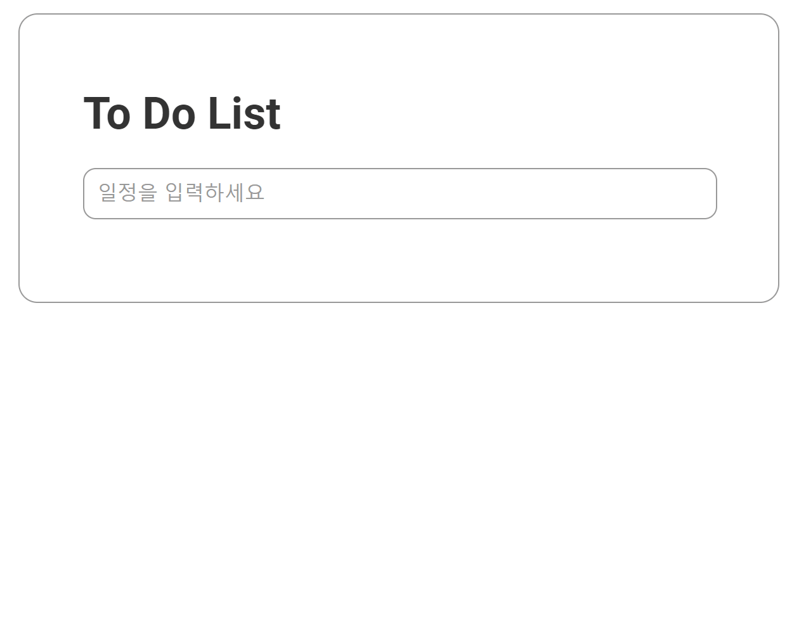

# TO Do List (일정관리앱)
## # 목차
## 1. version1 : vanilla script로 code작성 , localStorage 이용
## 2. version2 : version1기본 code를 class함수로 변경
## 3. version3 : module
---
# 1. version1
## 1.1 파일
-  vanilla script로 code작성

    html | css | js |
    |:---:|:---:|:---:|
    indext.html|reset.css| app.js 
    -|style.css| -
## 1.2 localStorage
-  localStorage를 사용하여 key와 value값을 Storage에 저장
-  Storage에 저장을 통해 새로고침을 하여도 데이터 유지가 가능


    ```javascript
    localStorage.setItem('key', 'value') : 데이터 저장하기
    localStorage.getItem('key')          : 데이터 가져오기
    localStorage.removeItem('key')     : 해당 키와 값 제거
    localStorage.clear()                    : Storage에 저장된 데이터 전체 제거
    ``` 
## 1.3 code 설명 및 javascript 기능 
- list 목록 데이터 추가 및 localStorage에 저장
    ```javascript
    const add = () => {
        let num = 0;
        num = localStorage.getItem("num",JSON.stringify(num));
        num++;
        localStorage.setItem("num",JSON.stringify(num));
        let obj = JSON.parse(localStorage.getItem("obj")) || [];
        obj = [
            ...obj, 
            {id:num, text: txt.value, change:false ,ischeck:false},
        ]
        localStorage.setItem("obj",JSON.stringify(obj));
    }
    ```
    
    

- 일정입력 칸에 글씨 작성 후 키보드 enter 누를시 list 작성 및 데이터 추가 가능<br> enter누를 시 input태그 value값 초기화 및 input태그로 자동 focus
    ```javascript
    form.addEventListener('submit',e=>{
        e.preventDefault();                
        add();
        show();
        txt.value='';
        txt.focus()
    }) 
    ```
- [수정 버튼] id값을 이용하여 input태그의 disabled속성을 false로 변경하여 내용 수정가능<br>텍스트 입력 후 enter키 누를시 [완료]버튼과 같은 기능 적용
    ```javascript
    changeBtn.addEventListener('click',e=>{
        let obj = JSON.parse(localStorage.getItem("obj"))
        const checkItem = obj.filter(item => item.id === id)
        changeId = id;
        checkItem[0].change = !checkItem[0].change;
        localStorage.setItem("obj", JSON.stringify(obj));
        show();
    })
    ```
- [완료 버튼] id값을 이용하여 새롭게 작성된 텍스트 데이터를 localStorage에 저장
    ```javascript
    complBtn.addEventListener('click',e=>{
        let obj = JSON.parse(localStorage.getItem("obj"));
        const checkItem = obj.filter(item => item.id === id)
        checkItem[0].text = userTxt.value
        checkItem[0].change = !checkItem[0].change;
        localStorage.setItem("obj", JSON.stringify(obj));
        show();
    })
    ```
- [삭제 버튼] id값을 이용하여 해당 데이터 삭제
    ```javascript
    delBtn.addEventListener('click',e=>{
        let obj = JSON.parse(localStorage.getItem("obj"))
        obj = obj.filter(item => item.id !== id);
        localStorage.setItem("obj", JSON.stringify(obj));
        show();
    })
    ```
- [checkbox] 미완료된 일정과 완료된 일정 구분가능<br> [checkbox]를 클릭하였을때 [삭제 버튼]만 클릭 가능하도록 구현
    ```javascript
    const obj = [
        {name:'이진솔', job: '웹퍼블리셔', tel: '010-2739-1928', imgUrl:'https://cdn.pixabay.com/photo/2016/01/18/05/09/woman-1146038_1280.jpg'},
            ...
    ]
    ```

## 1.4 화면 출력
- 결과물 video

    
---
# 2. version2
## 2.1 파일
-  class 함수를 사용

    html | css | js |
    |:---:|:---:|:---:|
    indext.html|reset.css| app.js 
    -|style.css| -

## 2.2 변경 code
- class 함수를 사용하여 class TodoList 생성
  ```javascript
    class TodoList{
        ...
    }
    const todoList = new TodoList;
    todoList.init();
  ```
# 3. version3
## 3.1 파일
-  module

    html | css | js |
    |:---:|:---:|:---:|
    indext.html|reset.css| app.js 
    -|style.css| getEle.js (module)
    -|-| show.js (module)

## 3.2 변경 code
- app.js
  ```javascript
    import {TodoList} from './module/show.js'
    import {get, getAll} from './module/getEle.js'
    ;(()=>{

        const form = get('.toDo form');
        const txt = get('.toDo form .userText');
        const out = get('.toDo .output');
        
        const todoList = new TodoList(form,txt,out);
        todoList.init();
    })();   
  ```
  
- getEle.js (module)
  ```javascript
    export const get = target => {
        if (document.querySelector(target)) {
            return document.querySelector(target);
        } else {
            throw 'ERROR - get';
        }
    };
    export const getAll = target => {
        ...
    };
  ```
- show.js (module)
  ```javascript
    export class TodoList{
        changeId = 0;
        constructor(form, txt, out){
            this.form = form
            this.txt = txt
            this.out = out
        }
        init( ){
            ...
        }
        ...
    }
  ```
  